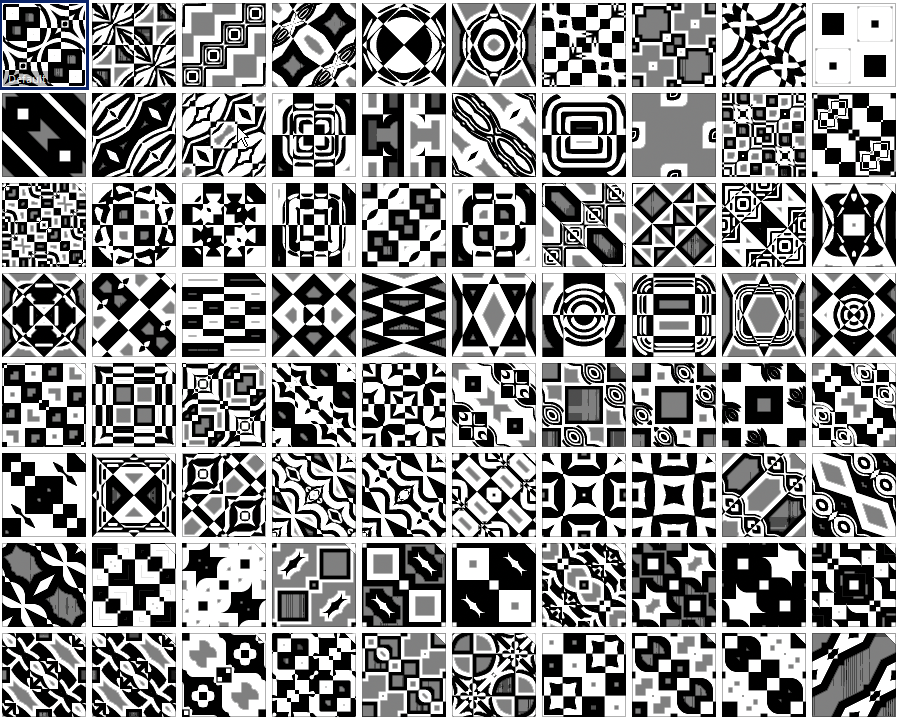
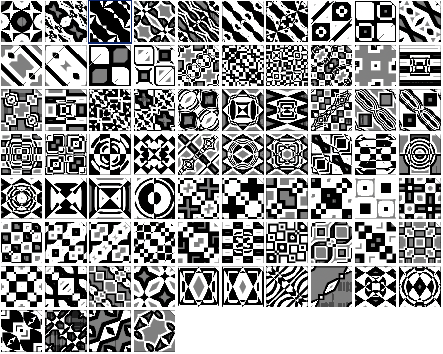

# Images Markdown Gallery

Click any image or title header to go to the source image.

### [`Library_14934_my_presets_001`](Library_14934_my_presets_001.png)

### [`Library_14934_my_presets_002`](Library_14934_my_presets_002.png)

*Created with [img2MDgallery.sh](https://github.com/earthbound19/_ebDev/blob/master/scripts/imgAndVideo/imgs2MDgallery.sh).*